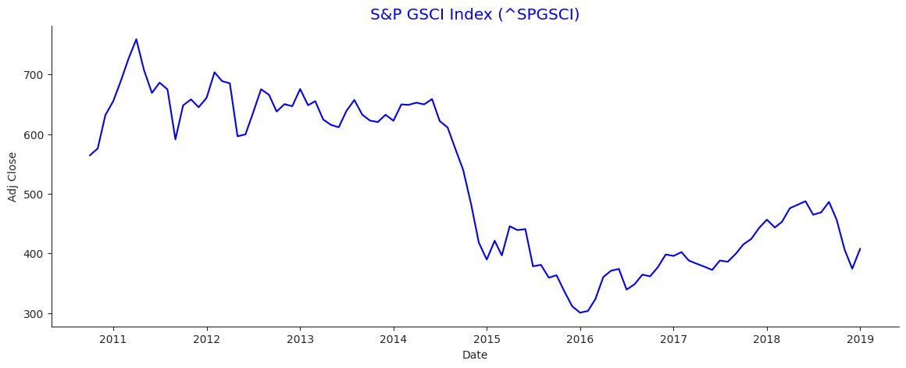
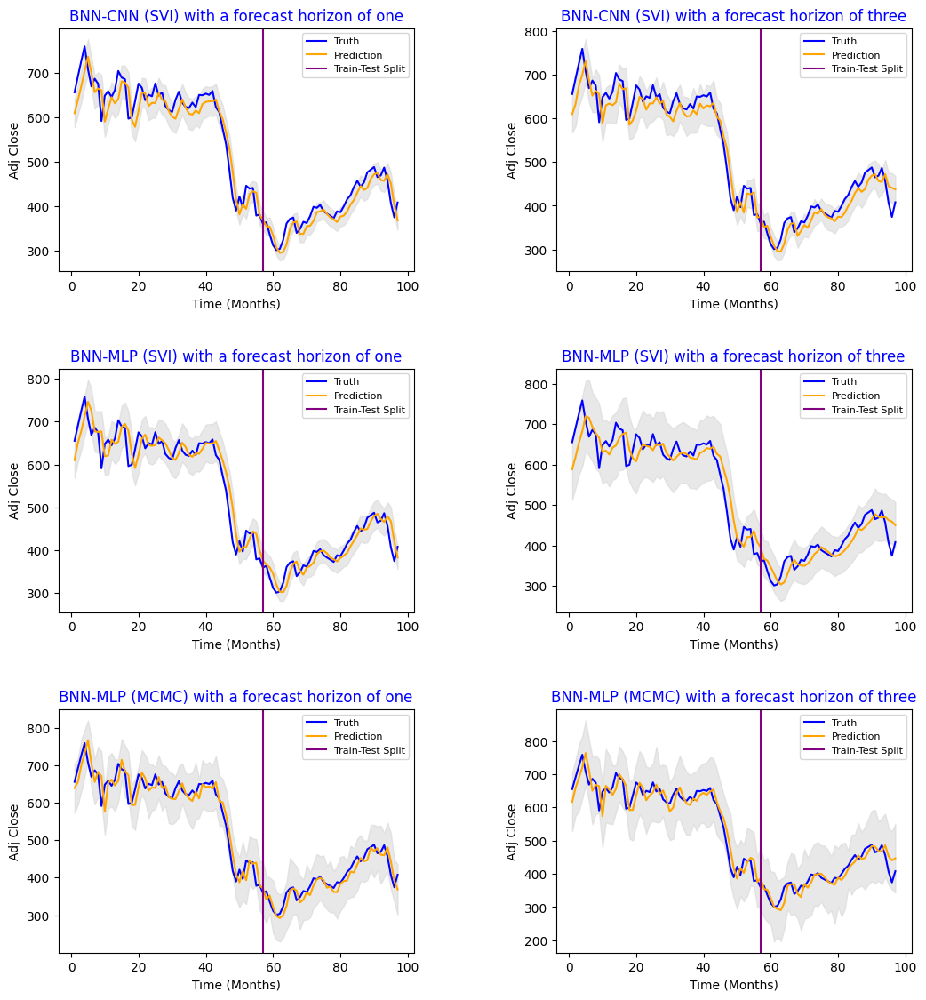
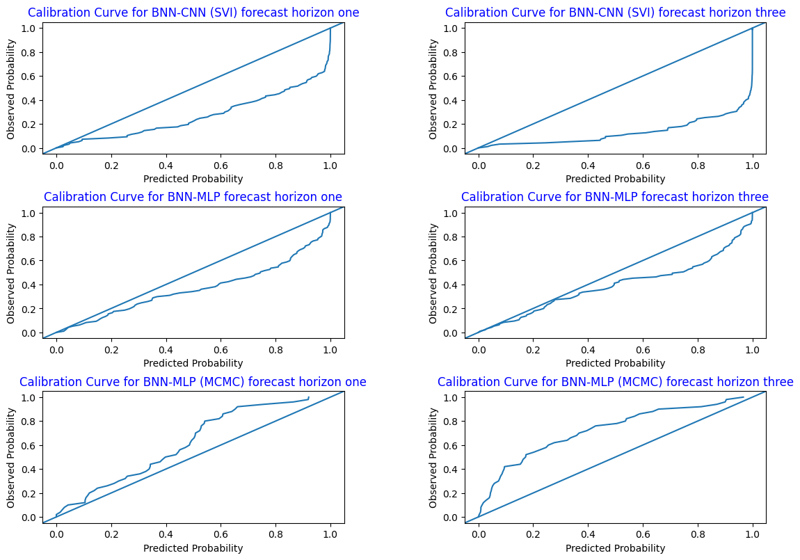

# Forecasting with Bayesian Neural Networks

This is the codebase for applying Bayesian Neural Networks to forecast commodity prices with uncertainty quantification. For this we utilize  both Stochastic Variational Inference and Markov Chain Monte Carlo methods.

In BNNs the model parameters of the network are random variables with own distributions optimized given the training data. During inference an objective variable gets optimized after sampling multiple model parametrizations. Hence, BNNs generate a distribution of the prediction, which reflects the uncertainty in the model's parameters and provides a more comprehensive view of the uncertainty associated with the prediction. 

### Datasets

The data used is the stock index of the S&P 500 GSCI, which is one of the most widely recognized benchmarks to represent global commodity markets. The values used are adjusted monthly closing values from the end of September 2010 until beginning of January 2019. The time series spans 100 months, a deliberate decision made to focus more on data with relevance to more recent patterns.

## Results

- For an example walkthrough please see: [BNN_forecasting](https://github.com/JanParlesak/BNN_forecasting/blob/main/Notebooks/BNN_forecasting.ipynb).

For training we us [Pyro](https://github.com/pyro-ppl/pyro), which is a PPL build on Python. We utilize BNNs in single-step-ahead as well as multi-step ahead stock-price forecasting. CNN- and MLP-BNN architectures are trained for the one- and three-step ahead prediction case.  Training is done with Stochastic Variational Inference (SVI). Additionally, the linear models are then also trained with MCMC (utilizing the NUTS-algorithm) for comparison.

To evaluate the quantification of the uncertainty of the models, the calibration of the models is assessed by means of a calibration curve.

